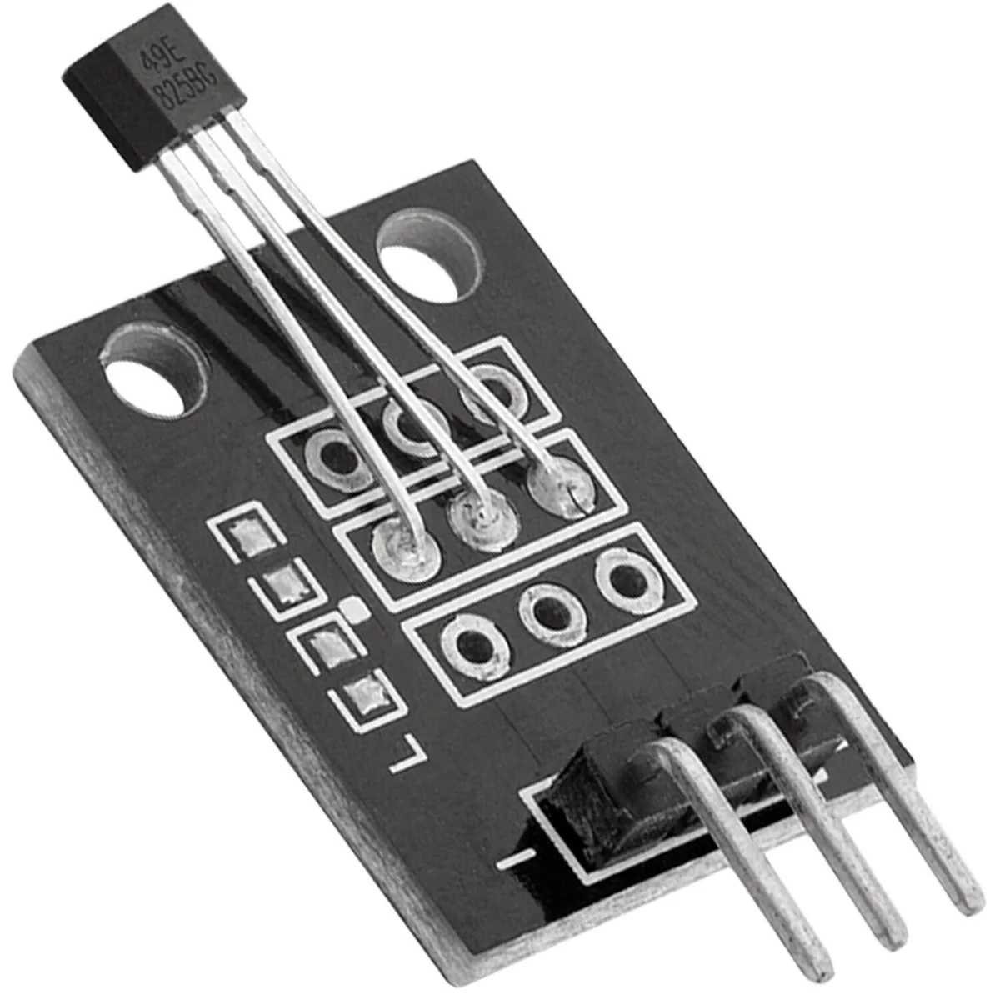
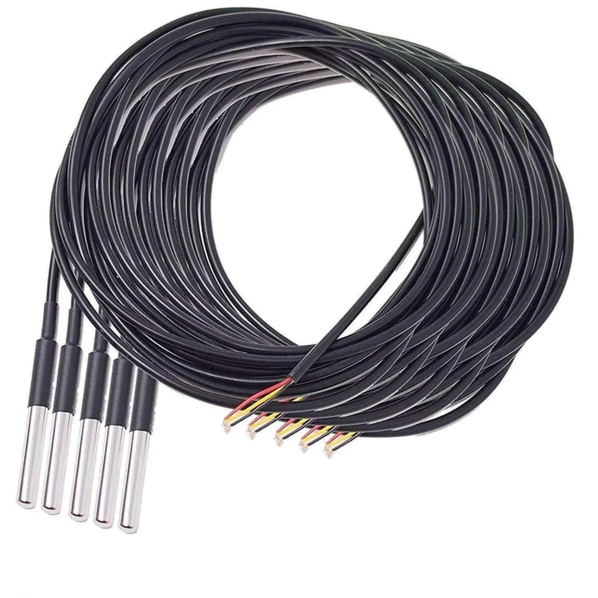

# MQTT GasCounter

ESP32-C6 basierter Gaszähler mit WiFi, MQTT, OLED-Display und **DS18B20 Temperaturmessung** (bis zu 3 Sensoren).

| ESP32-C6 SuperMini | OLED 0.96" | Hall-Sensor analog | DS18B20 Temperatursensor |
|---|---|---|---|
|  |  |  |  |

---

## DS18B20 Temperatursensoren

Bis zu **3 DS18B20 Sensoren** werden automatisch erkannt und über den 1-Wire Bus an **GPIO4** ausgelesen. Die Temperaturen werden auf dem OLED angezeigt und per MQTT publiziert.

### Bezug

[DS18B20 mit 3m Kabel – AZ-Delivery (2er Set)](https://www.az-delivery.de/en/products/2er-set-ds18b20-mit-3m-kabel)

### Elektrische Anbindung

```
ESP32-C6           DS18B20 #1    DS18B20 #2    DS18B20 #3
                   ┌─────────┐   ┌─────────┐   ┌─────────┐
3.3V ──┬───────────┤VCC      ├───┤VCC      ├───┤VCC      │
       │           │         │   │         │   │         │
       └──[4.7kΩ]──┤DQ       ├───┤DQ       ├───┤DQ       │
GPIO4 ─────────────┘         │   │         │   │         │
GND ───────────────┬─────────┤   ├─────────┤   ├─────────┤
                   │   GND   │   │   GND   │   │   GND   │
                   └─────────┘   └─────────┘   └─────────┘
```

> **Wichtig:** Ein **4,7 kΩ Pull-up-Widerstand** zwischen 3.3V und DQ (GPIO4) ist zwingend erforderlich. Alle Sensoren hängen parallel am selben Bus.

### Libraries

| Library | Installation |
|---|---|
| [OneWire](https://github.com/PaulStoffregen/OneWire) | `arduino-cli lib install "OneWire"` |
| [DallasTemperature](https://github.com/milesburton/Arduino-Temperature-Control-Library) | `arduino-cli lib install "DallasTemperature"` |

> **Hinweis ESP32-C6:** Die OneWire-Library (v2.3.8) benötigt einen Patch für den ESP32-C6. In `OneWire/util/OneWire_direct_gpio.h` alle Vorkommen von `#if CONFIG_IDF_TARGET_ESP32C3` durch `#if CONFIG_IDF_TARGET_ESP32C3 || CONFIG_IDF_TARGET_ESP32C6` ersetzen.

### MQTT Ausgabe

Die Temperaturen erscheinen im `gas_counter/state` Payload:

```json
{
  "temperature_0": 29.25,
  "temperature_1": 25.81,
  "temperature_2": 27.44
}
```

---

## Features

- Pulszählung per Reed-Kontakt / [Hall-Sensor analog](https://www.az-delivery.de/en/products/copy-of-hall-sensor-modul-analog) (GPIO3, analog mit Hysterese)
- Berechnung von Verbrauch in **kWh** und **m³**
- MQTT-Publish alle 10 Sekunden sowie sofort bei jedem Puls
- **DS18B20 Temperaturmessung** – bis zu 3 Sensoren parallel (GPIO4, 1-Wire)
- **Persistenz** des Gesamtzählers im NVS (überlebt Reboot)
- **Stunden-Rollover**: Verbrauch pro Stunde wird getrennt gezählt
- **OLED-Anzeige** (SSD1306 128×64) mit Echtzeit-Werten
- **WS2812 RGB-LED**: grün = online, rot = Puls erkannt
- BOOT-Button: Reset aller Zähler
- WiFi- und MQTT-Reconnect automatisch

---

## Hardware

| Komponente | Modell |
|---|---|
| Mikrocontroller | ESP32-C6 SuperMini |
| Display | 0.96" OLED SSD1306 (I2C, 128×64) |
| LED | WS2812 onboard (GPIO8) |
| Sensor | Reed-Kontakt / [Hall-Sensor analog – AZ-Delivery](https://www.az-delivery.de/en/products/copy-of-hall-sensor-modul-analog) |
| Temperatursensoren | [DS18B20 mit 3m Kabel – AZ-Delivery (2er Set)](https://www.az-delivery.de/en/products/2er-set-ds18b20-mit-3m-kabel) |

### Pinbelegung

| GPIO | Funktion |
|---|---|
| GPIO0 | OLED SDA |
| GPIO1 | OLED SCL |
| GPIO3 | Sensor (Puls, analog) |
| GPIO4 | DS18B20 1-Wire (bis zu 3 Sensoren parallel) |
| GPIO8 | WS2812 NeoPixel |
| GPIO9 | BOOT Button |

### Vollständige Verdrahtung

```
ESP32-C6 SuperMini          OLED SSD1306
┌─────────────────┐         ┌──────────┐
│             3.3V├─────────┤VCC       │
│              GND├─────────┤GND       │
│            GPIO0├─────────┤SDA       │
│            GPIO1├─────────┤SCL       │
│                 │         └──────────┘
│            GPIO3├────────────┤ Reed-Sensor / Hallsensor
│              GND├────────────┤ (anderer Pol)
│                 │
│            GPIO4├──────┬─────────────┤ DS18B20 #1 (DQ)
│             3.3V├──┐   │  ┌──────────┤ DS18B20 #2 (DQ)
│              GND├──┤   │  │  ┌───────┤ DS18B20 #3 (DQ)
│                 │  │   │  │  │
│                 │  └─[4.7kΩ]─┘ (Pull-up zwischen 3.3V und DQ)
│                 │
│            GPIO8│  WS2812 (onboard)
│            GPIO9│  BOOT Button (onboard)
└─────────────────┘
```

---

## MQTT Topics

| Topic | Inhalt |
|---|---|
| `gas_counter/state` | JSON mit Verbrauchswerten (retained) |
| `gas_counter/gpio2` | Sensorpin-Status: `LOW` / `HIGH` (retained) |
| `gas_counter/availability` | `online` / `offline` (LWT, retained) |

### Payload Beispiel

```json
{
  "total_kwh": 123.456,
  "hour_kwh": 0.105,
  "pulses_total": 11757,
  "pulses_hour": 10,
  "adc": 3306,
  "rssi": -67,
  "temperature_0": 29.25,
  "temperature_1": 25.81,
  "temperature_2": 27.44
}
```

---

## OLED Display

```
GasCounter        RSSI:-67dBm
─────────────────────────────
123.46 kWh
Gesamt
─────────────────────────────
Std: 0.105 kWh
Pulse: 11757
```

---

## Konfiguration

In `src/main.cpp`:

```cpp
static const char* WIFI_SSID = "dein-netzwerk";
static const char* WIFI_PASS = "dein-passwort";
static const char* MQTT_HOST = "192.168.1.x";

static const float PULSE_VOLUME_M3 = 0.01f;  // m³ pro Puls
static const float GAS_KWH_PER_M3  = 10.5f;  // kWh-Umrechnungsfaktor
```

---

## Build & Flash

```bash
# Kompilieren
arduino-cli compile \
  --fqbn "esp32:esp32:esp32c6:UploadSpeed=921600,CDCOnBoot=cdc,CPUFreq=160,FlashFreq=80,FlashMode=qio,FlashSize=4M,PartitionScheme=default,DebugLevel=none,EraseFlash=none" \
  --libraries ~/Arduino/libraries \
  .

# Flashen
arduino-cli upload \
  --fqbn "esp32:esp32:esp32c6:UploadSpeed=921600,CDCOnBoot=cdc,CPUFreq=160,FlashFreq=80,FlashMode=qio,FlashSize=4M,PartitionScheme=default,DebugLevel=none,EraseFlash=none" \
  -p /dev/ttyACM0 \
  .

# Monitor
tio /dev/ttyACM0 -b 115200
```

Oder per Makefile:

```bash
make flash    # kompilieren + flashen
make monitor  # serieller Monitor
```

---

## Libraries

| Library | Zweck |
|---|---|
| PubSubClient | MQTT |
| Adafruit NeoPixel | WS2812 RGB-LED |
| Adafruit SSD1306 | OLED Display |
| Adafruit GFX Library | Grafik-Primitives |
| OneWire | 1-Wire Kommunikation |
| DallasTemperature | DS18B20 Temperatursensoren |
