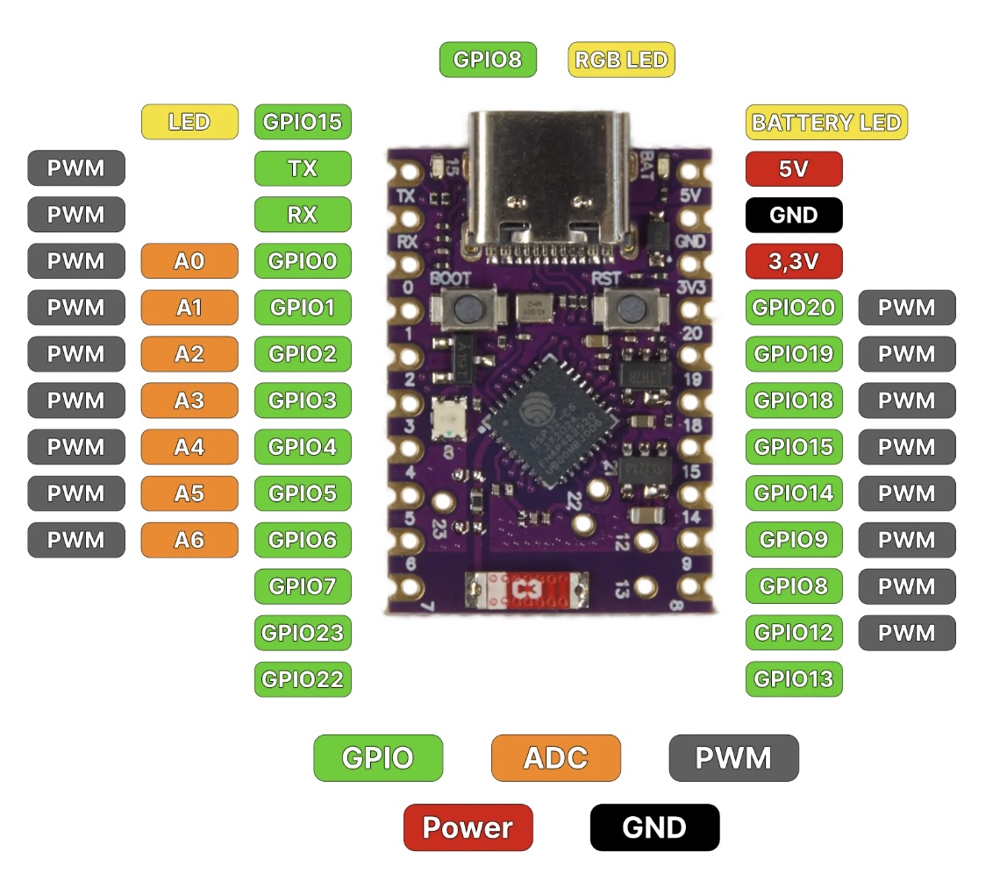

# MQTT GasCounter

ESP32-C6 basierter Gaszähler mit WiFi, MQTT und OLED-Display.

| ESP32-C6 SuperMini | OLED 0.96" |
|---|---|
|  |  |

---

## Features

- Pulszählung per Reed-Kontakt / Hallsensor (GPIO3, Interrupt + Debounce)
- Berechnung von Verbrauch in **kWh** und **m³**
- MQTT-Publish alle 10 Sekunden sowie sofort bei jedem Puls
- **Persistenz** des Gesamtzählers im NVS (überlebt Reboot)
- **Stunden-Rollover**: Verbrauch pro Stunde wird getrennt gezählt
- **OLED-Anzeige** (SSD1306 128×64) mit Echtzeit-Werten
- **WS2812 RGB-LED**: grün = online, rot = Puls erkannt
- BOOT-Button: Reset aller Zähler
- WiFi- und MQTT-Reconnect automatisch

---

## Hardware

| Komponente | Modell |
|---|---|
| Mikrocontroller | ESP32-C6 SuperMini |
| Display | 0.96" OLED SSD1306 (I2C, 128×64) |
| LED | WS2812 onboard (GPIO8) |
| Sensor | Reed-Kontakt / Hallsensor |

### Pinbelegung

| GPIO | Funktion |
|---|---|
| GPIO0 | OLED SDA |
| GPIO1 | OLED SCL |
| GPIO3 | Sensor (Puls, INPUT_PULLUP) |
| GPIO8 | WS2812 NeoPixel |
| GPIO9 | BOOT Button |

### Verdrahtung

```
ESP32-C6 SuperMini          OLED SSD1306
┌─────────────────┐         ┌──────────┐
│             3.3V├─────────┤VCC       │
│              GND├─────────┤GND       │
│            GPIO0├─────────┤SDA       │
│            GPIO1├─────────┤SCL       │
│                 │         └──────────┘
│            GPIO3├────────────┤ Reed-Sensor / Hallsensor
│              GND├────────────┤ (anderer Pol)
│                 │
│            GPIO8│  WS2812 (onboard)
│            GPIO9│  BOOT Button (onboard)
└─────────────────┘
```

> Sensor: Ein Pol an GPIO3, anderer Pol an GND. GPIO3 ist intern auf HIGH gezogen (INPUT_PULLUP), ein Puls zieht auf LOW.

---

## MQTT Topics

| Topic | Inhalt |
|---|---|
| `gas_counter/state` | JSON mit Verbrauchswerten (retained) |
| `gas_counter/gpio2` | Sensorpin-Status: `LOW` / `HIGH` (retained) |
| `gas_counter/availability` | `online` / `offline` (LWT, retained) |

### Payload Beispiel

```json
{
  "total_kwh": 123.456,
  "hour_kwh": 0.105,
  "pulses_total": 11757,
  "pulses_hour": 10,
  "rssi": -67
}
```

---

## OLED Display

```
GasCounter        RSSI:-67dBm
─────────────────────────────
123.46 kWh
Gesamt
─────────────────────────────
Std: 0.105 kWh
Pulse: 11757
```

---

## Konfiguration

In `src/main.cpp`:

```cpp
static const char* WIFI_SSID = "dein-netzwerk";
static const char* WIFI_PASS = "dein-passwort";
static const char* MQTT_HOST = "192.168.1.x";

static const float PULSE_VOLUME_M3 = 0.01f;  // m³ pro Puls
static const float GAS_KWH_PER_M3  = 10.5f;  // kWh-Umrechnungsfaktor
```

---

## Build & Flash

```bash
# Kompilieren
arduino-cli compile \
  --fqbn "esp32:esp32:esp32c6:UploadSpeed=921600,CDCOnBoot=cdc,CPUFreq=160,FlashFreq=80,FlashMode=qio,FlashSize=4M,PartitionScheme=default,DebugLevel=none,EraseFlash=none" \
  --libraries ~/Arduino/libraries \
  .

# Flashen
arduino-cli upload \
  --fqbn "esp32:esp32:esp32c6:UploadSpeed=921600,CDCOnBoot=cdc,CPUFreq=160,FlashFreq=80,FlashMode=qio,FlashSize=4M,PartitionScheme=default,DebugLevel=none,EraseFlash=none" \
  -p /dev/ttyACM0 \
  .

# Monitor
tio /dev/ttyACM0 -b 115200
```

Oder per Makefile:

```bash
make flash    # kompilieren + flashen
make monitor  # serieller Monitor
```

---

## Libraries

| Library | Zweck |
|---|---|
| PubSubClient | MQTT |
| Adafruit NeoPixel | WS2812 RGB-LED |
| Adafruit SSD1306 | OLED Display |
| Adafruit GFX Library | Grafik-Primitives |
